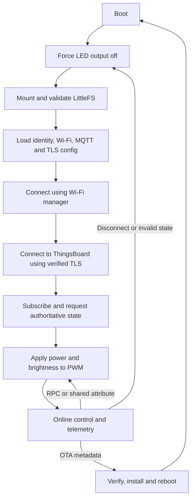
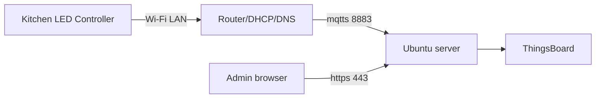

# Kitchen LED Controller Production Plan

## 1. Purpose

Create a separate production firmware repository for a single-channel kitchen
LED controller. The first hardware target is ESP32-WROOM-32D driving an external
MOSFET with PWM. ESP32-S3 and ESP32-C6 are secondary targets that must remain
possible without changing product-domain code.

The firmware will use `hq_platform` as a pinned Git submodule and will connect
to a ThingsBoard instance hosted on an Ubuntu machine in the local network.
MQTT communication will use TLS and an access token initially. Optional mutual
TLS and two manufacturing credential workflows will be designed and evaluated
separately.

This document is an implementation plan. Every implementation stage is kept in
a small merge request with focused tests and code review.

## 2. Confirmed Product Decisions

| Topic | Decision |
|---|---|
| First MCU/module | ESP32-WROOM-32D |
| Future MCU support | ESP32-S3 and ESP32-C6 |
| LED power stage | External MOSFET |
| Control | On/off and PWM brightness |
| PWM polarity | Compile-time option: active-high or active-low |
| Offline behavior | Turn LED off when ThingsBoard connection is lost |
| Boot behavior | Keep LED off until authoritative state is read from ThingsBoard |
| Local wall control | Not required in the first release |
| Wi-Fi onboarding | Existing Wi-Fi manager, integrated in a separate stage |
| Initial authentication | Verified server TLS plus per-device access token |
| Optional authentication | Mutual TLS with per-device certificate/key |
| Device filesystem | LittleFS through OSAL |
| MQTT certificate directory | `/cert` |
| Configuration storage | Filesystem, with secrets protected by production controls |
| OTA | Required |
| Secure boot/flash encryption | Deferred, but design must not block later enablement |
| Failure state | LED output off |

## 3. Current Platform Assessment

### 3.1 Reusable without major redesign

- OSAL tasks, mutexes, timers, files, directories, mounting, and OTA APIs.
- ESP LittleFS backend and POSIX LittleFS backend for host tests.
- Wi-Fi configuration persistence and Wi-Fi management modules.
- Mongoose MQTT transport with reconnect support.
- MQTT TLS configuration using CA, client certificate, and private-key paths.
- ThingsBoard client, telemetry, attributes, RPC, provisioning, and OTA modules.
- The software-only ThingsBoard RGB lamp example as a reference for state,
  attributes, RPC, telemetry, and reconnect behavior.
- The TLS and provisioning demos as protocol references.

### 3.2 Platform gaps to close

- There is no public OSAL GPIO/PWM abstraction. Product code must not depend
  directly on ESP-IDF LEDC APIs.
- External ESP-IDF project integration needs a documented and tested component
  contract for using `hq_platform` as a submodule.
- Wi-Fi and MQTT JSON files can contain secrets in plaintext. This is acceptable
  only for initial development. Production release criteria must state the
  physical-access threat model and later enable flash encryption or another
  secure-storage strategy.
- ThingsBoard X.509 provisioning currently models the request/response protocol,
  but a complete CSR, certificate issuance, installation, renewal, and private
  key lifecycle is not yet provided.
- Atomic configuration replacement, schema migration, and recovery must be
  implemented at the product layer or promoted into `hq_platform` when reusable.

## 4. Repository Strategy

Create a new private GitHub repository, suggested name:

```text
kitchen-led-controller
```

Proposed structure:

```text
kitchen-led-controller/
├── .github/
│   └── workflows/
├── components/
│   ├── app_config/
│   ├── device_identity/
│   ├── lamp_control/
│   ├── manufacturing/
│   └── tb_application/
├── main/
│   ├── CMakeLists.txt
│   └── app_main.c
├── platform/
│   └── hq_platform/          # Git submodule
├── scripts/
│   ├── manufacturing/
│   └── server/
├── server/
│   ├── compose.yaml
│   ├── mosquitto-or-proxy/
│   └── README.md
├── tests/
├── CMakeLists.txt
├── Kconfig.projbuild
├── partitions.csv
├── sdkconfig.defaults
├── README.md
└── SECURITY.md
```

Add the platform as a pinned submodule:

```bash
git submodule add <HQ_PLATFORM_GITHUB_URL> platform/hq_platform
git submodule update --init --recursive
```

Rules:

1. Pin the submodule to an reviewed commit; never track an unbounded branch in
   production builds.
2. Platform changes are submitted to `hq_platform` first, reviewed there, then
   consumed by a separate submodule-bump merge request in the product repo.
3. Product behavior stays in the new repository. Reusable OSAL or transport
   capabilities stay in `hq_platform`.
4. Record the platform commit in firmware build metadata and telemetry.

## 5. High-Level Architecture



Layer ownership:

- `lamp_control`: state validation and hardware-independent LED policy.
- OSAL PWM/GPIO: platform-independent hardware API and ESP LEDC backend.
- `app_config`: schemas, atomic persistence, migration, and defaults.
- existing Wi-Fi manager: onboarding and network connection.
- `tb_application`: ThingsBoard state synchronization, commands, telemetry, and
  disconnect fail-off behavior.
- `device_identity`: access-token or mTLS credential selection.
- `manufacturing`: first-boot state and credential installation workflow.
- `hq_platform`: MQTT/TLS, ThingsBoard protocol, OSAL, and OTA primitives.

## 6. LED Hardware and PWM Contract

### 6.1 Electrical decisions before PCB release

- Confirm MOSFET gate voltage and logic-level operation at the MCU voltage.
- Confirm MOSFET current, thermal margin, LED supply voltage, and flyback needs.
- Add gate resistor and gate pull-down so the MOSFET is off during reset/boot.
- Select a GPIO that is not a boot strapping pin and is supported on all chosen
  board variants, or provide a board-specific pin configuration.
- Verify whether the final power stage is active-high or active-low.
- Measure PWM frequency for audible noise, visible flicker, and driver behavior.

### 6.2 Compile-time configuration

Proposed Kconfig options in the product repository:

```text
CONFIG_KLC_LED_PWM_GPIO
CONFIG_KLC_LED_PWM_FREQUENCY_HZ
CONFIG_KLC_LED_PWM_RESOLUTION_BITS
CONFIG_KLC_LED_PWM_ACTIVE_LOW
CONFIG_KLC_DEFAULT_BRIGHTNESS_PERCENT
CONFIG_KLC_THINGSBOARD_SYNC_TIMEOUT_MS
CONFIG_KLC_TELEMETRY_PERIOD_MS
```

Recommended initial defaults:

```text
PWM frequency: 20000 Hz
PWM resolution: 12 bits
Active-low: false
Default brightness: 100 percent, but output remains off until synchronized
```

The frequency must be confirmed with the actual MOSFET and LED power stage.

### 6.3 State semantics

```c
typedef struct {
    bool power;
    uint8_t brightness_percent;
} lamp_state_t;
```

- Brightness range is `0..100`.
- `power=false` always produces the electrical off duty cycle.
- `power=true` and `brightness=0` also produces off output but preserves the
  requested power state for protocol consistency.
- Invalid values are rejected at protocol boundaries, not silently wrapped.
- On boot, Wi-Fi loss, MQTT loss, TLS failure, state-sync timeout, or fatal
  configuration error, the hardware output is forced off.
- State is not persisted locally in release 1. ThingsBoard is authoritative.

## 7. Filesystem and Configuration Layout

Mount LittleFS at `/littlefs` on ESP. Application paths below are logical OSAL
paths and must be consistently resolved through the mount point.

```text
/cert/
├── ca.crt
├── device.crt             # optional mTLS mode
└── device.key             # optional mTLS mode; sensitive

/config/
├── wifi.json
├── mqtt.json
├── device.json
└── manufacturing.json

/state/
└── ota.json
```

Recommended content ownership:

- `/cert/ca.crt`: CA used to verify the MQTT endpoint.
- `/cert/device.crt`: unique device certificate for optional mTLS.
- `/cert/device.key`: unique private key for optional mTLS.
- `/config/wifi.json`: existing Wi-Fi manager schema or an adapter to it.
- `/config/mqtt.json`: broker DNS name, port, TLS mode, certificate paths, client
  ID, and authentication mode. Avoid duplicate token storage if identity owns it.
- `/config/device.json`: schema version, product, hardware revision, serial
  number, ThingsBoard device name, and non-secret settings.
- `/config/manufacturing.json`: manufacturing state and credential mode; do not
  store the provisioning secret here in a production unit after enrollment.
- `/state/ota.json`: OTA transaction state owned by the OSAL OTA flow.

Configuration requirements:

1. Include `schema_version` in every product-owned JSON document.
2. Enforce maximum file size and field lengths.
3. Write to a temporary file, flush/close, validate by reading it back, then
   atomically replace the live file where the OSAL supports it.
4. Keep a last-known-good copy for critical identity and MQTT configuration.
5. Never log passwords, tokens, provisioning secrets, certificates, or keys.
6. Reject `skip_verify=true` in production builds.
7. Create `/cert`, `/config`, and `/state` explicitly after mounting.
8. Factory reset must erase credentials and configuration, then force output off.

### 7.1 Partition table

Use a custom partition table from the start. Size it after measuring the actual
firmware binary, but reserve:

- NVS and PHY data.
- OTA data.
- Two OTA application slots.
- LittleFS large enough for certificates, configuration, rollback copies, and
  diagnostics. The existing 64 KiB example storage partition is likely too
  small for comfortable production operation; start evaluation at 256 KiB.

ESP32-WROOM-32D flash size must be confirmed from the exact module SKU before
final partition offsets are frozen.

## 8. ThingsBoard Device Contract

### 8.1 Shared attributes

ThingsBoard is the desired-state authority:

```json
{
  "power": false,
  "brightness": 0
}
```

At every successful connection:

1. Subscribe to shared-attribute updates.
2. Request current `power` and `brightness` attributes.
3. Keep LED off while waiting.
4. Validate both fields.
5. Apply the state only after a valid response.
6. If synchronization times out, remain off and retry after reconnect/backoff.

### 8.2 Server-side RPC

Initial methods:

- `setPower` with `{"power": true}`.
- `setBrightness` with `{"brightness": 0..100}`.
- `setState` with both fields.
- `getState` returning desired and applied state.

RPC processing requirements:

- Validate method, JSON type, range, and required fields.
- Apply hardware state before returning success.
- Return explicit error JSON for invalid requests or hardware failures.
- Publish resulting telemetry after a successful state change.
- Decide whether RPC also updates shared attributes. Recommended: dashboard
  changes should write shared attributes; RPC is for transient operations and
  test/service use unless server-side rule chains synchronize it.

### 8.3 Telemetry

Publish on connect, state change, and periodically:

```json
{
  "power": false,
  "brightness": 0,
  "pwm_duty": 0,
  "connection_state": "online",
  "fw_version": "1.0.0",
  "hardware": "esp32-wroom-32d",
  "uptime_ms": 123456
}
```

Do not publish secrets or full certificate details. A certificate fingerprint or
expiry timestamp may be added later.

## 9. TLS and Local Network Plan

### 9.1 Recommended topology



Use a stable DNS name, not a raw changing IP. Recommended local name:

```text
thingsboard.home.arpa
```

Do not use `.local` unless mDNS behavior is intentionally configured. The
`home.arpa` domain is reserved for home networks.

### 9.2 Router configuration

1. Assign the Ubuntu server a DHCP reservation, for example `192.168.1.20`.
2. Add a local DNS record:
   `thingsboard.home.arpa -> 192.168.1.20`.
3. If the router cannot add local DNS records, run AdGuard Home, Pi-hole, or
   `dnsmasq` on Ubuntu and configure DHCP clients to use it.
4. Keep ThingsBoard LAN-only initially. Do not configure Internet port
   forwarding for MQTT or the dashboard.
5. Optionally place IoT devices in a dedicated VLAN later. Permit only DNS,
   NTP, DHCP, and access to the required ThingsBoard ports.

### 9.3 Ubuntu server baseline

1. Install supported Ubuntu LTS updates and configure a static DHCP lease.
2. Install Docker Engine and the Compose plugin from Docker's official packages.
3. Create a dedicated service directory such as `/srv/thingsboard`.
4. Run ThingsBoard and PostgreSQL with Docker Compose using pinned image tags.
5. Store database data in a named volume or `/srv/thingsboard/data`.
6. Put the web UI behind a TLS reverse proxy such as Caddy or Nginx.
7. Expose MQTT TLS on TCP 8883. Keep unencrypted MQTT 1883 disabled in
   production or bound only to localhost for migration/testing.
8. Configure `ufw` to allow SSH from the admin subnet, HTTPS 443 from the LAN,
   and MQTT TLS 8883 from the IoT subnet.
9. Configure time synchronization; TLS validation requires correct device and
   server time policy.
10. Back up PostgreSQL, ThingsBoard configuration, CA material, and compose
    files. Test restore, not only backup creation.

### 9.4 Certificate strategy for a LAN-only server

Public ACME certificates generally cannot validate a private `home.arpa` name.
Use a private CA:

1. Create an offline or carefully protected local root CA.
2. Issue a server certificate with SAN `DNS:thingsboard.home.arpa`.
3. Configure the MQTT TLS listener with the server certificate and key.
4. Install only the root CA certificate on each device as `/cert/ca.crt`.
5. Configure MQTT URL as `mqtts://thingsboard.home.arpa:8883`.
6. Enable certificate and hostname verification; never enable skip-verify.
7. Set certificate lifetimes and document renewal before expiry.
8. Keep the CA private key off the ThingsBoard runtime host when possible.

Development may use a short-lived test CA, but production firmware must not
embed or trust development roots.

## 10. Authentication and Manufacturing Options

### 10.1 Option A: server TLS plus access token

This is the recommended first production increment.

Manufacturing flow:

1. Generate a unique device serial number and client ID.
2. Create or pre-provision the ThingsBoard device.
3. Obtain a unique access token for that device.
4. Install `/cert/ca.crt` and device identity/configuration.
5. Install the access token through the manufacturing fixture or perform a
   one-time ThingsBoard provisioning request.
6. Verify TLS connection, attribute synchronization, telemetry, RPC, and OTA.
7. Record device serial, MAC address, firmware version, platform commit, and
   ThingsBoard device ID in the manufacturing database.
8. Remove provisioning key/secret from the device after successful enrollment.

Advantages: simpler server and device lifecycle, fully supported by the current
client path. Risk: the bearer token must be protected from filesystem extraction.

### 10.2 Option B1: certificate/key injected by manufacturing station

1. Manufacturing PKI creates a unique private key and certificate per device.
2. The fixture writes `/cert/device.key`, `/cert/device.crt`, and `/cert/ca.crt`.
3. The fixture writes mTLS MQTT configuration and verifies connection.
4. PKI records certificate serial, device serial, issuance, and expiry.
5. The CA supports revocation and reissuance procedures.

Advantages: straightforward implementation and recovery. Risk: the private key
exists outside the device and must be protected by fixture and PKI controls.

### 10.3 Option B2: key generated on-device with CSR enrollment

1. Device generates its private key locally.
2. Device creates a CSR containing the assigned device identity.
3. Manufacturing service authenticates the device/fixture and signs the CSR.
4. Only the certificate and CA chain return to the device.
5. Device stores the private key and certificate, then verifies mTLS connection.

Advantages: private key never leaves the device. Risks: requires a new crypto/
CSR API, secure entropy verification, enrollment protocol, certificate renewal,
and stronger at-rest key protection. Without flash encryption or a secure
element, on-device generation does not prevent physical extraction from flash.

### 10.4 Recommendation and decision gate

Implement Option A first. Prototype B1 and B2 as separate merge requests and
choose after measuring manufacturing complexity and defining the threat model.
Do not claim mTLS production readiness until certificate renewal and revocation
are tested.

## 11. Wi-Fi Manager Integration

Treat the existing Wi-Fi manager as an external dependency with a narrow adapter:

```c
typedef struct {
    void (*on_connected)(void *context);
    void (*on_disconnected)(void *context);
    void *context;
} network_callbacks_t;

int network_manager_start(const network_callbacks_t *callbacks);
bool network_manager_is_connected(void);
```

Integration requirements:

- Product code must not depend on the manager's internal storage schema.
- Wi-Fi onboarding runs before ThingsBoard connection.
- Wi-Fi disconnect immediately forces LED off and informs the connection state
  machine.
- Credentials are never printed.
- Factory reset clears Wi-Fi configuration and device credentials.
- Add BLE/SoftAP/UART details only after reviewing the existing manager project.

## 12. OTA and Recovery

- Use two OTA slots and OSAL OTA APIs.
- Verify SHA-256 for every image.
- Add signed firmware verification before production rollout. TLS protects
  transport but does not replace artifact authenticity.
- Persist OTA state and use ESP rollback/health confirmation.
- Keep LED off during unsafe initialization and reboot transitions.
- Roll out by ThingsBoard device groups: internal, canary, then production.
- Report OTA states and errors through telemetry.
- Prevent downgrade unless explicitly authorized for recovery.
- Keep a documented UART recovery and full-flash procedure for manufacturing.

## 13. Portability Across ESP32 Variants

ESP32-WROOM-32D is the release target. ESP32-S3 and ESP32-C6 are portability
targets, not assumed binary-compatible targets.

- Keep GPIO number, PWM timer/channel, polarity, and frequency in board config.
- Keep product logic dependent only on OSAL PWM/GPIO APIs.
- Build separate `sdkconfig.defaults` overlays per board.
- Validate flash size and partition table per board/module.
- ESP32-C6 uses a RISC-V core; never introduce architecture-specific assumptions.
- Add compile-only CI jobs for S3/C6 after the WROOM-32D path is stable.
- Add hardware smoke tests before declaring either secondary target supported.

## 14. Merge Request Implementation Roadmap

Every MR must include a description, acceptance criteria, focused tests, and a
review checklist. Avoid combining platform changes, product behavior, and server
operations in one MR.

### MR 001: Create product repository skeleton

Scope:

- Create ESP-IDF project, README, license decision, CODEOWNERS, formatting, and
  basic CI.
- Add `hq_platform` as a pinned submodule.
- Build an empty application for ESP32-WROOM-32D.

Acceptance and validation:

- Fresh recursive clone configures and builds.
- CI verifies submodule initialization and clean build.
- Review checks pinned versions and no generated build output committed.

### MR 002: Define product Kconfig and board profiles

Scope:

- Add product configuration options for board, GPIO, PWM frequency/resolution,
  polarity, telemetry period, and sync timeout.
- Add WROOM-32D defaults and placeholder S3/C6 overlays.

Acceptance and validation:

- Invalid GPIO/frequency/resolution combinations fail configuration.
- CI compiles WROOM-32D profile.
- Review checks that no credentials are compile-time defaults.

### MR 003: Document and test external hq_platform integration

Repository: `hq_platform` first, then a submodule bump in the product repo.

Scope:

- Provide a supported ESP-IDF external-component integration contract including
  OSAL, Mongoose, Wi-Fi, and ThingsBoard components.
- Add a minimal consumer fixture or build test.

Acceptance and validation:

- A standalone ESP-IDF consumer builds without copying platform sources.
- ThingsBoard headers and component dependencies resolve transitively.
- Review checks public/private component dependencies.

### MR 004: Add OSAL GPIO/PWM API contract

Repository: `hq_platform`.

Scope:

- Add public PWM types and lifecycle API: initialize, set duty, force inactive,
  and deinitialize.
- Define normalized duty units independent of ESP LEDC resolution.
- Add POSIX mock/backend for tests.

Acceptance and validation:

- Unit tests cover zero, maximum, range rejection, lifecycle errors, and active
  polarity mapping.
- No product-specific LED naming enters OSAL.
- Review checks ISR/thread-safety and failure behavior.

### MR 005: Implement ESP LEDC backend

Repository: `hq_platform`.

Scope:

- Implement PWM API using ESP-IDF LEDC.
- Support ESP32, S3, and C6 capability differences through ESP-IDF APIs.
- Force configured inactive level before enabling PWM.

Acceptance and validation:

- WROOM-32D build succeeds.
- Hardware smoke test measures off, 25%, 50%, 100%, and polarity behavior.
- Review checks boot glitches, timer/channel ownership, and cleanup.

### MR 006: Add lamp-control domain component

Scope:

- Implement validated `lamp_state_t`, fail-off, duty conversion, and hardware
  adapter calls.
- No network or ThingsBoard dependency.

Acceptance and validation:

- Host tests cover all boundaries and both polarities.
- Hardware remains off before initialization and after explicit fail-off.
- Review checks integer rounding and overflow.

### MR 007: Add LittleFS partition and filesystem bootstrap

Scope:

- Add custom OTA-capable partition table.
- Mount via OSAL and create `/cert`, `/config`, and `/state`.
- Define recovery behavior for missing/corrupt filesystem.

Acceptance and validation:

- First boot formats only when policy permits; ordinary mount errors do not
  silently erase existing credentials.
- Directory creation is idempotent.
- Review checks partition sizes against measured binary size.

### MR 008: Add versioned product configuration service

Scope:

- Implement `device.json` and manufacturing-state schemas.
- Add bounds validation, temporary writes, last-known-good recovery, and
  migration hooks.

Acceptance and validation:

- Host tests cover valid, missing, truncated, oversized, and malformed files.
- Secrets are redacted from logs.
- Review checks power-loss behavior during update.

### MR 009: Integrate existing Wi-Fi manager

Scope:

- Add the narrow network adapter.
- Map connected/disconnected callbacks into the application state machine.
- Keep LED off until network and ThingsBoard state are ready.

Acceptance and validation:

- Hardware test covers valid credentials, invalid credentials, AP loss, and
  reconnect.
- Wi-Fi loss forces LED off within a specified latency.
- Review checks callback concurrency and credential logging.

### MR 010: Add TLS filesystem configuration

Scope:

- Load broker DNS name and CA path from validated config.
- Configure `mqtts://`, CA verification, and hostname verification.
- Reject plaintext MQTT and skip-verify in production profile.

Acceptance and validation:

- Integration tests cover trusted CA success, unknown CA failure, expired cert
  where test tooling permits, and hostname mismatch failure.
- Review checks all certificate paths remain under `/cert`.

### MR 011: Add access-token device identity

Scope:

- Load one device token and stable client ID from manufacturing storage.
- Initialize ThingsBoard only after TLS and identity validation.

Acceptance and validation:

- Missing/invalid token leaves output off and reports a redacted error.
- Valid token connects without logging its value.
- Review checks ownership and zeroization opportunities.

### MR 012: Implement ThingsBoard desired-state synchronization

Scope:

- Subscribe to shared attributes and request `power` and `brightness` on every
  connection.
- Keep output off until a complete valid state is received.

Acceptance and validation:

- Tests cover valid state, partial state, invalid types/ranges, timeout,
  duplicate update, and reconnect.
- Disconnect always calls lamp fail-off.
- Review checks stale callback/session handling.

### MR 013: Add ThingsBoard RPC control

Scope:

- Add `setPower`, `setBrightness`, `setState`, and `getState`.
- Return structured success/error responses.

Acceptance and validation:

- Unit tests cover every valid and invalid method payload.
- Hardware state is applied before success response.
- Review checks authorization assumptions and payload limits.

### MR 014: Add telemetry and health reporting

Scope:

- Publish applied state on connect/change and periodic health telemetry.
- Include firmware/platform versions and uptime; exclude secrets.

Acceptance and validation:

- Tests verify JSON shape, disconnect behavior, and rate limits.
- Review checks telemetry volume and privacy.

### MR 015: Add application state machine and watchdog policy

Scope:

- Integrate boot, filesystem, Wi-Fi, TLS, synchronization, online, degraded,
  OTA, and fatal states.
- Add watchdog ownership and bounded retry/backoff.

Acceptance and validation:

- Fault-injection tests cover each transition.
- Every failure path forces LED off.
- Review checks deadlocks, callback context, and retry storms.

### MR 016: Deploy LAN ThingsBoard stack

Scope:

- Add pinned Docker Compose stack, PostgreSQL persistence, reverse proxy, MQTT
  TLS listener, environment template, firewall, backup, and restore docs.
- Do not commit private keys or real passwords.

Acceptance and validation:

- Clean Ubuntu host deployment succeeds from documentation.
- MQTT TLS endpoint presents correct hostname and chain.
- Backup restore is tested.
- Review checks image pinning, secrets handling, and exposed ports.

### MR 017: Add development CA and production PKI procedures

Scope:

- Add scripts/instructions for local CA, server CSR/certificate, renewal, and
  device trust-store installation.
- Keep generated private material ignored.

Acceptance and validation:

- TLS integration test validates success and expected failures.
- Review checks SAN, key usage, permissions, and expiry policy.

### MR 018: Add access-token manufacturing fixture flow

Scope:

- Define serial allocation, device creation/provisioning, token installation,
  fixture verification, audit record, and provisioning-secret removal.

Acceptance and validation:

- Re-running fixture is safe and reports already-enrolled devices explicitly.
- A rejected unit cannot enter normal online state.
- Review checks that no secrets enter CI artifacts or logs.

### MR 019: Add OTA integration

Scope:

- Integrate ThingsBoard firmware metadata/chunks with OSAL OTA.
- Add SHA-256, signed image verification, rollback, and health confirmation.

Acceptance and validation:

- Tests cover success, checksum/signature failure, interrupted download,
  oversized image, rollback, and confirmation.
- Hardware test performs canary upgrade and forced rollback.
- Review checks partition bounds and downgrade policy.

### MR 020: Prototype injected mTLS manufacturing option

Scope:

- Install unique certificate/key via fixture and configure MQTT mTLS.
- Add certificate metadata and expiry reporting without exposing key material.

Acceptance and validation:

- Unique certificate connects; revoked/wrong certificate fails.
- File permissions and factory-reset behavior are verified.
- Review produces a documented go/no-go decision for B1.

### MR 021: Prototype on-device key and CSR option

Scope:

- Add or select a proven CSR implementation, generate key on-device, enroll,
  install certificate, and test renewal.

Acceptance and validation:

- Private key is never transmitted.
- Entropy, CSR identity, failed enrollment, renewal, and revocation are tested.
- Review produces a documented go/no-go decision for B2.

### MR 022: Add production hardening profile

Scope:

- Remove development roots/endpoints, disable debug credential paths, define
  release logging, evaluate flash encryption and secure boot, and document the
  accepted physical threat model.

Acceptance and validation:

- Automated release audit finds no default credentials or private keys.
- Production configuration rejects plaintext MQTT and skip-verify.
- Review requires explicit security sign-off.

### MR 023: Add ESP32-S3 and ESP32-C6 build profiles

Scope:

- Add board-specific defaults and compile CI.
- Keep WROOM-32D behavior unchanged.

Acceptance and validation:

- All three targets compile.
- PWM and fail-off smoke tests pass on available S3/C6 hardware before support
  is advertised.
- Review checks board pin and peripheral differences.

### MR 024: Production release candidate

Scope:

- Freeze dependency commits, generate SBOM/release manifest, complete test
  matrix, write manufacturing release instructions, and tag release candidate.

Acceptance and validation:

- Fresh clone reproducibly builds signed artifacts.
- End-to-end test covers manufacture, Wi-Fi onboarding, TLS connection, state
  sync, RPC, telemetry, disconnect fail-off, OTA, rollback, and factory reset.
- Open high-severity defects are zero.

## 15. Standard Code Review Checklist

Apply this checklist to every MR:

- Scope is one independently testable behavior.
- No generated build output or credentials are committed.
- Product code uses OSAL/platform abstractions.
- All externally supplied strings, JSON, paths, and numeric ranges are bounded.
- Every failure path leaves the LED off where applicable.
- No token, password, provisioning secret, certificate payload, or key is logged.
- Thread/callback ownership is explicit.
- Success and failure tests are included.
- Documentation and configuration examples are updated.
- WROOM-32D build remains green.
- Security impact and rollback strategy are stated.

## 16. Test Strategy

### Host tests

- Lamp state and duty conversion.
- Configuration schema and corruption recovery.
- ThingsBoard RPC and attribute parsing using existing mocks.
- Connection-state transitions and fail-off calls.
- Manufacturing-state transitions.

### Integration tests

- MQTT TLS with trusted/unknown CA and hostname mismatch.
- ThingsBoard provisioning and access-token connection.
- Reconnect and authoritative state resynchronization.
- OTA success and all verification failures.
- Server backup and restore.

### Hardware tests

- Boot/reset output remains off.
- PWM duty and polarity measured with oscilloscope or logic analyzer.
- Wi-Fi and MQTT disconnect latency to LED off.
- Brownout/power-loss during configuration write and OTA.
- Long-running reconnect and telemetry soak.
- Thermal validation at maximum LED load.

## 17. Release Gates

Release 1 is allowed only when:

1. ESP32-WROOM-32D hardware and flash size are fixed.
2. MOSFET electrical and thermal validation passes.
3. Fail-off is verified on boot, Wi-Fi loss, MQTT loss, TLS failure, invalid
   state, watchdog reset, and OTA transition.
4. TLS verifies the private CA and DNS hostname.
5. Every device uses a unique access token.
6. Development credentials and CAs are absent from release artifacts.
7. OTA rollback is tested on hardware.
8. ThingsBoard/PostgreSQL backup restore is tested.
9. Manufacturing records map serial, MAC, firmware, platform commit, and
   ThingsBoard identity.
10. The accepted risk of unencrypted credential storage is documented, or flash
    encryption is enabled before deployment outside a controlled environment.

## 18. Remaining Decisions

Resolve these before the referenced MR begins:

- Exact WROOM-32D board/module flash size and selected PWM GPIO.
- MOSFET part, LED voltage/current, and measured acceptable PWM frequency.
- Existing Wi-Fi manager repository/API and onboarding method.
- Final local subnet and router capability for DHCP reservation/local DNS.
- ThingsBoard deployment edition and version.
- Access-token installation by direct fixture injection versus ThingsBoard
  provisioning key/secret.
- Whether mTLS B1 or B2 proceeds after prototypes.
- Certificate validity and renewal windows.
- Timing for enabling flash encryption and secure boot.

## 19. Recommended First Milestone

Complete MRs 001 through 015 using development credentials and a development CA.
This produces a hardware controller that remains off until it securely connects
and synchronizes state, supports remote power/brightness, reports telemetry, and
fails off on disconnect. In parallel, complete MRs 016 and 017 for the local
server. Then complete manufacturing, OTA, security, and release MRs before the
first production batch.